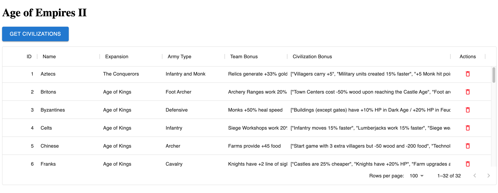
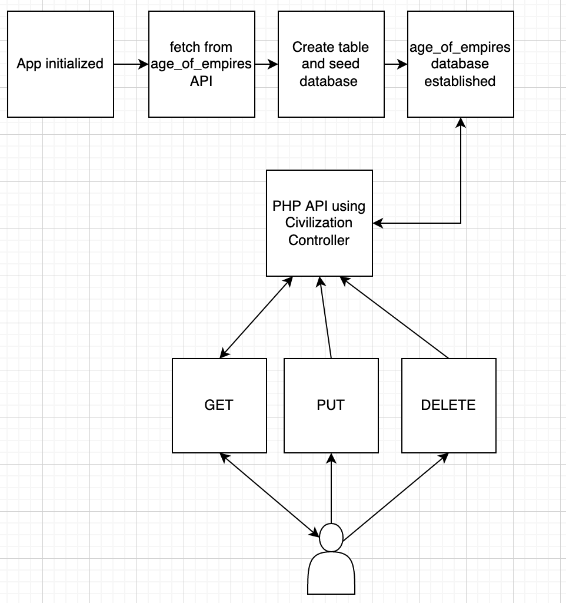

# Laravel React CRUD App

# Project Backlog
- See Trello Board: https://trello.com/b/VYNs6ATW/larvel-react-crud-app

# Setup Instructions
1. Clone this repository
2. Start MySQL Server locally (should be on port 127.0.0.1)
3. This project assumes your db user has a name of "root" and a password of "" (no password). If this is not the case, you will need to edit the `.env` file to match your db credentials.
4. Create a new database named `age_of_empires` by running `CREATE DATABASE age_of_empires;` in the `mysql` prompt within the terminal
5. In the root folder of the project, run the following commands: `composer i`, `npm i`, `npm run dev`, `php artisan serve`

 You should be able to view the app in `127.0.0.1:8000` in the browser.

 

 # App Usage
- Click `Get Civilizations` to fill the table with data from the database
- Double click on cells to edit them. When finished editing, just click out of the cells to trigger the update. ***Do not*** hit enter - there's a bug in MaterialUI that causes issues.
- Click on the red trash can icon to remove a result from the database.
- If you delete/modify records and want to return the data to its original state, you'll need to run `php artisan migrate:refresh` and then `php artisan serve`.

All actions should result in an instanteous page update, while also persisting the changes. You can refresh the page and/or click `Get Civilizations` again to verify persistence.

# System Architecture Diagram

